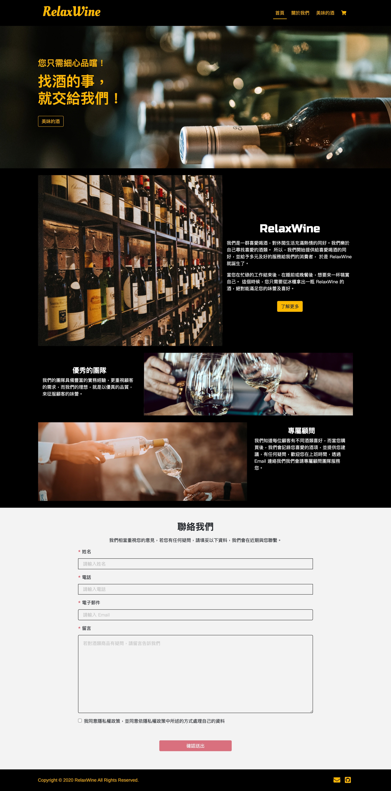

# RelaxWine

A unique wine e-commerce website always satisfies your desire to buy wine

## Website Link

Frontstage: <https://cross1469.github.io/RelaxWine/>\
Backstage: <https://cross1469.github.io/RelaxWine/#/admin>

## Techniques

- Front-End Web Design
  - HTML / CSS / JavaScript
  - Responsive Web Design (RWD)
  - Bootstrap
  - SCSS
- Frameworks
  - Vue
  - Vue Router
- Networking
  - Using [vue-axios](https://www.npmjs.com/package/vue-axios) to access data
- Other
  - Version Control : Git / GitHub
  - Lint Tool: ESLint with airbnb style
  - validation: [vee-validate](https://www.npmjs.com/package/vee-validate)

## Website Structure

- Frontstage
  - Home - About us, product guide
  - Product list - switch category, add to cart
  - Product details - select the number of products to add to the shopping cart
  - Checkout - Confirm shopping cart items, apply coupon codes, fill orders
  - Place order - Complete checkout
- Backstage
  - Admin Login
  - Product Management - Add, delete, edit products
  - Coupon Management - Add, delete, edit coupons
  - Order Management - View and modify orders

## Contact

If you got any problem when using Cryptocurrency Exchange, or had any suggestion about it. Please feel free to contact with me via email.

- Author: Oakley, Liu
- E-mail: <face9923029@gmail.com>
- Image source: [Unsplash](https://unsplash.com)
